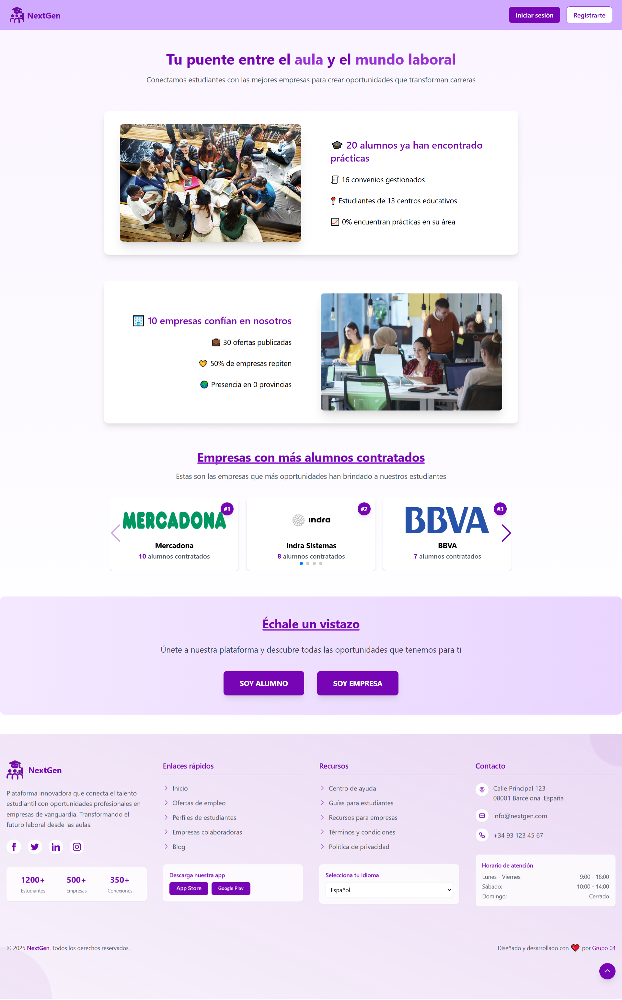
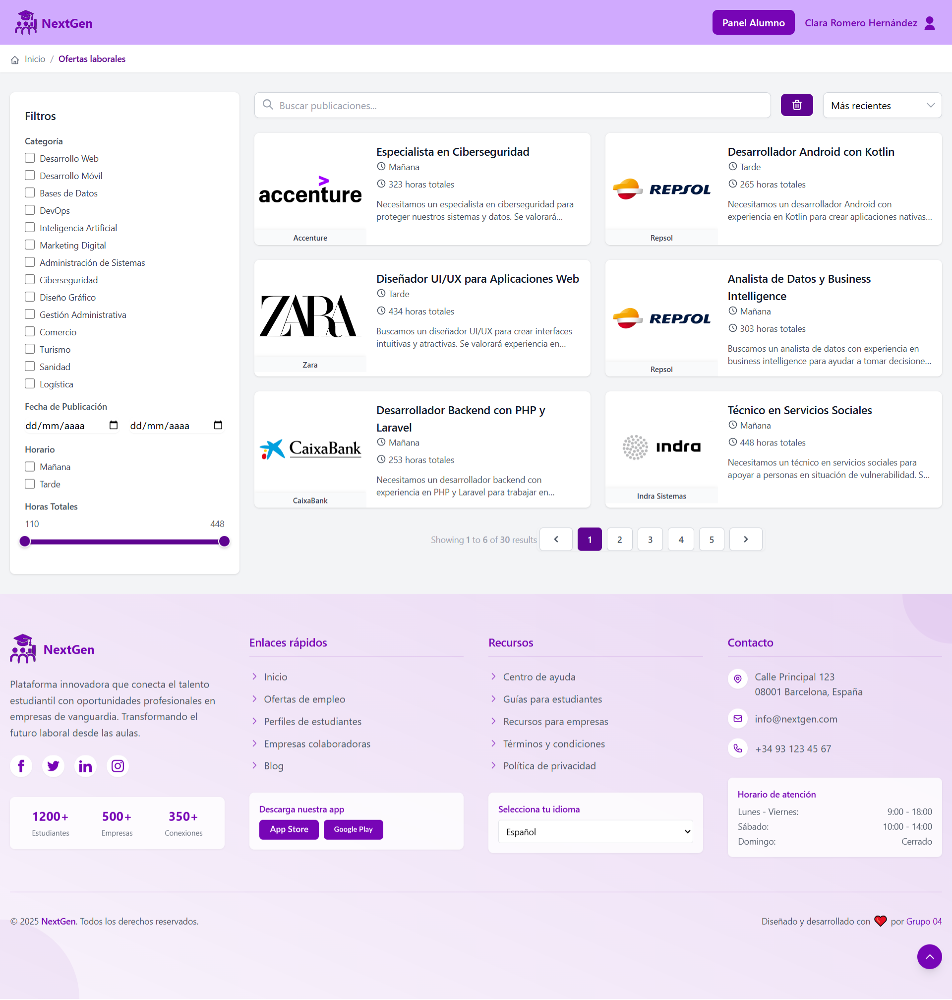
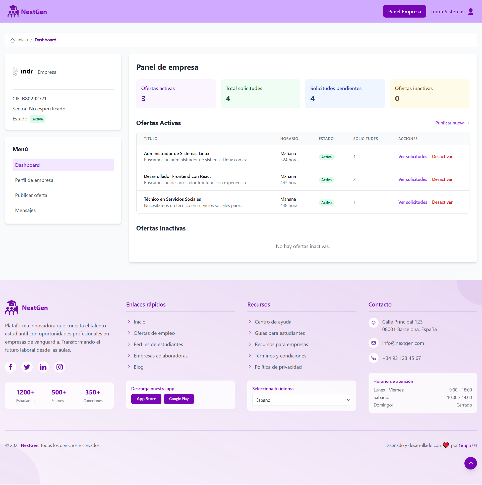
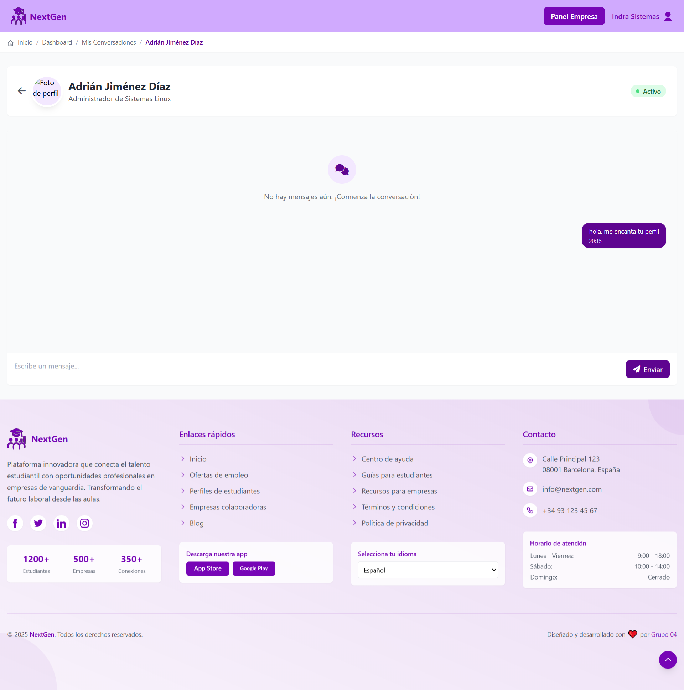
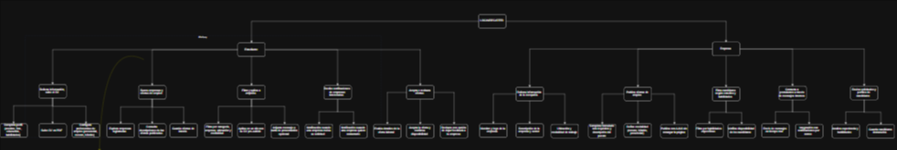

<div align="center">
  
  <h1>🌟 NextGen 🌟</h1>
  <h3>🚀 Plataforma de Conexión Educativa y Profesional 🚀</h3>

  [](https://github.com/tu-usuario/nextgen)
  [](LICENSE)
  [](https://php.net)
  [](https://laravel.com)
  [](https://mysql.com)
  [](https://developer.mozilla.org/en-US/docs/Web/JavaScript)
  
  <p>
    <b>📊 Conectando el talento académico con oportunidades profesionales 📈</b>
  </p>
</div>

---

## 📋 Tabla de Contenidos

- [✨ Visión General](#-visión-general)
- [🎯 Características Principales](#-características-principales)
- [🛠️ Tecnologías Utilizadas](#️-tecnologías-utilizadas)
- [📦 Requisitos del Sistema](#-requisitos-del-sistema)
- [⚙️ Instalación y Configuración](#️-instalación-y-configuración)
- [👥 Roles de Usuario](#-roles-de-usuario)
- [🗂️ Estructura del Proyecto](#️-estructura-del-proyecto)
- [📱 Capturas de Pantalla](#-capturas-de-pantalla)
- [🔄 Flujo de Trabajo](#-flujo-de-trabajo)
- [👨‍💻 Equipo de Desarrollo](#-equipo-de-desarrollo)
- [🧪 Testing](#-testing)
- [📈 Roadmap](#-roadmap)
- [🤝 Contribución](#-contribución)
- [📄 Licencia](#-licencia)
- [🙏 Agradecimientos](#-agradecimientos)

---

## ✨ Visión General


**NextGen** es una plataforma innovadora diseñada para transformar la forma en que estudiantes y empresas se conectan en el ámbito educativo y profesional. Nuestro proyecto nace de la necesidad de crear un puente efectivo entre el mundo académico y el mercado laboral, facilitando:

- 🎓 A los **estudiantes**: Encontrar oportunidades de prácticas y empleo acordes a su formación
- 🏢 A las **empresas**: Descubrir talento joven con las habilidades específicas que necesitan
- 🔄 A **ambos**: Establecer relaciones profesionales con base en información transparente y comunicación directa

Este ecosistema digital permite optimizar el proceso de búsqueda y selección, reduciendo tiempos y mejorando la calidad de las conexiones entre candidatos y oportunidades.

---

## 🎯 Características Principales

### Para Estudiantes 👨‍🎓👩‍🎓

- **🪪 Perfiles Educativos Detallados**: Crea un perfil completo con tus habilidades, formación y experiencia
- **🔍 Búsqueda Avanzada**: Encuentra ofertas filtradas por categoría, ubicación y tipo
- **📝 Solicitudes Simplificadas**: Aplica a ofertas con un solo clic y gestiona todas tus aplicaciones
- **⭐ Sistema de Favoritos**: Guarda las ofertas que más te interesan para revisarlas después
- **📊 Seguimiento de Progreso**: Monitoriza el estado de tus solicitudes en tiempo real
- **💬 Chat Integrado**: Comunícate directamente con las empresas durante el proceso
- **🏆 Historial de Experiencias**: Mantén un registro de tus prácticas y valoraciones

### Para Empresas 🏢

- **🏗️ Perfiles Corporativos**: Presenta tu empresa, valores y cultura organizacional
- **📢 Publicación de Ofertas**: Crea y gestiona ofertas de prácticas y empleo
- **👁️ Panel de Control**: Visualiza estadísticas y métricas de tus publicaciones
- **📨 Gestión de Solicitudes**: Revisa, filtra y gestiona las aplicaciones recibidas
- **🤝 Convenios Automatizados**: Genera convenios de prácticas con los estudiantes seleccionados
- **📈 Análisis de Rendimiento**: Obtén insights sobre el rendimiento de tus publicaciones
- **⭐ Sistema de Valoraciones**: Evalúa a los estudiantes que han completado programas contigo

### Características Generales 🌐

- **🔐 Autenticación Segura**: Sistema robusto de registro y autenticación
- **🔄 Actualizaciones en Tiempo Real**: Notificaciones instantáneas sobre cambios relevantes
- **📱 Diseño Responsive**: Experiencia óptima en cualquier dispositivo
- **🌍 Multilenguaje**: Soporte para múltiples idiomas (Español, Catalán, Inglés)
- **🎨 Interfaz Intuitiva**: UX/UI diseñada pensando en la usabilidad
- **🔎 Búsqueda Semántica**: Algoritmo inteligente para matchmaking entre perfiles y ofertas

---

## 🛠️ Tecnologías Utilizadas

<div align="center">
  <table>
    <tr>
      <th>Categoría</th>
      <th>Tecnologías</th>
    </tr>
    <tr>
      <td>🖥️ Backend</td>
      <td>
        
        
        
      </td>
    </tr>
    <tr>
      <td>🎨 Frontend</td>
      <td>
        
        
        
        
      </td>
    </tr>
    <tr>
      <td>🗄️ Base de Datos</td>
      <td>
        
        
      </td>
    </tr>
    <tr>
      <td>🔌 APIs y Servicios</td>
      <td>
        
        
      </td>
    </tr>
    <tr>
      <td>🧪 Testing</td>
      <td>
        
        
      </td>
    </tr>
    <tr>
      <td>🚀 DevOps</td>
      <td>
        
        
        
      </td>
    </tr>
  </table>
</div>

---

## 📦 Requisitos del Sistema

Para ejecutar NextGen en un entorno de desarrollo o producción, necesitarás:

### Requisitos de Software 🖥️

- **PHP** >= 8.2
- **Composer** >= 2.0
- **Node.js** >= 18.0
- **NPM** >= 8.0
- **MySQL** >= 8.0 (o MariaDB >= 10.5)
- **Servidor web**: Apache 2.4+ o Nginx 1.18+

### Requisitos de Hardware Recomendados 🔧

- **Procesador**: Dual-core 2GHz o superior
- **RAM**: Mínimo 4GB (8GB recomendado)
- **Almacenamiento**: 20GB de espacio libre en disco
- **Conexión a Internet**: Estable (para APIs externas y Pusher)

### Requisitos Opcionales 📱

- **Cuenta de Pusher** para funcionalidad de chat en tiempo real
- **Servicio de correo SMTP** para notificaciones por email

---

## ⚙️ Instalación y Configuración

### Paso 1: Clonar el Repositorio 📋

```bash
git clone https://github.com/tu-usuario/nextgen.git
cd nextgen
```

### Paso 2: Instalar Dependencias 📦

```bash
# Instalar dependencias de PHP
composer install

# Instalar dependencias de JavaScript
npm install
```

### Paso 3: Configurar el Entorno 🔧

```bash
# Copiar archivo de entorno
cp .env.example .env

# Generar clave de aplicación
php artisan key:generate
```

Edita el archivo `.env` con la configuración de tu base de datos:

```
DB_CONNECTION=mysql
DB_HOST=127.0.0.1
DB_PORT=3306
DB_DATABASE=nextgen
DB_USERNAME=tu_usuario
DB_PASSWORD=tu_contraseña

PUSHER_APP_ID=tu_app_id
PUSHER_APP_KEY=tu_app_key
PUSHER_APP_SECRET=tu_app_secret
PUSHER_APP_CLUSTER=tu_app_cluster
```

### Paso 4: Preparar la Base de Datos 🗄️

```bash
# Ejecutar migraciones
php artisan migrate

# Cargar datos iniciales
php artisan db:seed
```

### Paso 5: Compilar Assets 🎨

```bash
# Desarrollo
npm run dev

# Producción
npm run build
```

### Paso 6: Iniciar el Servidor 🚀

```bash
php artisan serve
```

Ahora puedes acceder a la aplicación en `http://localhost:8000`

### Cuentas de Demostración 🔑

| Tipo | Email | Contraseña |
|------|-------|------------|
| 👨‍🎓 Estudiante | estudiante1@educacion.es | password |
| 🏢 Empresa | contacto@indra.es | password |
| 👨‍💼 Admin | admin@sistema.com | password |

---

## 👥 Roles de Usuario

NextGen opera con un sistema de roles bien definido para gestionar los permisos y el acceso a diferentes funcionalidades:

### 👨‍🎓 Estudiantes

- **Permisos**: 
  - Crear y gestionar perfil personal
  - Buscar y aplicar a ofertas
  - Participar en chats con empresas
  - Gestionar solicitudes enviadas
  - Valorar empresas tras finalizar convenios

### 🏢 Empresas

- **Permisos**:
  - Crear y gestionar perfil corporativo
  - Publicar y gestionar ofertas
  - Revisar solicitudes recibidas
  - Comunicarse con candidatos
  - Gestionar convenios activos
  - Valorar estudiantes tras finalizar convenios

### 👨‍💼 Administradores

- **Permisos**:
  - Acceso completo al sistema
  - Gestión de usuarios (crear, editar, eliminar)
  - Moderación de contenido
  - Gestión de categorías y subcategorías
  - Visualización de estadísticas y métricas
  - Resolución de incidencias

---

## 🗂️ Estructura del Proyecto

NextGen sigue una arquitectura MVC (Modelo-Vista-Controlador) basada en Laravel, con una organización clara de directorios:

```
nextgen/
├── app/                 # Lógica principal de la aplicación
│   ├── Models/          # Modelos de datos (User, Estudiante, Empresa, etc.)
│   ├── Http/            # Controladores, Middleware y Requests
│   └── Providers/       # Proveedores de servicios
├── database/            # Migraciones y seeders
├── resources/           # Vistas y assets
│   ├── views/           # Plantillas Blade organizadas por módulos
│   │   ├── admin/       # Vistas del panel de administración
│   │   ├── student/     # Vistas específicas para estudiantes
│   │   ├── empresa/     # Vistas específicas para empresas
│   │   └── ...
│   ├── js/              # Código JavaScript
│   └── css/             # Estilos CSS
├── routes/              # Definición de rutas
│   ├── web.php          # Rutas web principales
│   └── api.php          # Endpoints de API
├── config/              # Archivos de configuración
├── public/              # Archivos accesibles públicamente
└── tests/               # Pruebas automatizadas
```

### Modelos Principales 📊

- **User**: Base para la autenticación y gestión de usuarios
- **Estudiante**: Perfil y datos específicos de estudiantes
- **Empresa**: Perfil y datos específicos de empresas
- **Publicacion**: Ofertas publicadas por empresas
- **Solicitud**: Aplicaciones de estudiantes a ofertas
- **Chat**: Sistema de mensajería entre usuarios
- **Valoracion**: Evaluaciones tras finalizar convenios
- **Categoria/Subcategoria**: Taxonomía para clasificar ofertas

---

## 📱 Capturas de Pantalla

<div align="center">
  
  <p><i>Dashboard principal de NextGen</i></p>
  
  <br>
  
  <div style="display: flex; justify-content: space-between;">
    <div style="width: 48%;">
      
      <p><i>Perfil de Estudiante</i></p>
    </div>
    <div style="width: 48%;">
      
      <p><i>Panel de Empresa</i></p>
    </div>
  </div>
  
  <br>
  
  
  <p><i>Sistema de Chat en Tiempo Real</i></p>
</div>

---

## 🔄 Flujo de Trabajo

<div align="center">
  
</div>

### Proceso para Estudiantes 👨‍🎓

1. **Registro y Creación de Perfil**: El estudiante se registra y completa su perfil educativo
2. **Exploración de Ofertas**: Busca y filtra las oportunidades disponibles
3. **Aplicación**: Envía su solicitud a las ofertas que le interesan
4. **Comunicación**: Interactúa con la empresa a través del chat si es preseleccionado
5. **Selección**: Si es aceptado, se establece un convenio formal
6. **Realización**: Completa el periodo de prácticas o trabajo
7. **Valoración**: Al finalizar, valora su experiencia con la empresa

### Proceso para Empresas 🏢

1. **Registro y Creación de Perfil**: La empresa se registra y completa su perfil corporativo
2. **Publicación de Ofertas**: Crea y publica oportunidades con requisitos detallados
3. **Gestión de Solicitudes**: Revisa las aplicaciones recibidas
4. **Preselección**: Contacta con candidatos potenciales vía chat
5. **Formalización**: Establece un convenio con los candidatos seleccionados
6. **Seguimiento**: Supervisa el progreso durante el periodo establecido
7. **Valoración**: Al finalizar, valora el desempeño del estudiante

---

## 👨‍💻 Equipo de Desarrollo

<div align="center">
  <table>
    <tr>
      <td align="center">
        <!--  -->
        <br>
        <b>Juanjo</b>
        <br>
        <i>Backend Developer</i>
        <br>
        <a href="https://github.com/JuanjGomez">GitHub</a>
      </td>
      <td align="center">
        <!--  -->
        <br>
        <b>Àngel</b>
        <br>
        <i>Frontend Developer</i>
        <br>
        <a href="https://github.com/AngelCampsRuiz">GitHub</a>
      </td>
      <td align="center">
        <!--  -->
        <br>
        <b>Deiby</b>
        <br>
        <i>Full Stack Developer</i>
        <br>
        <a href="https://github.com/deiby14">GitHub</a>
      </td>
    </tr>
    <tr>
      <td align="center">
        <!--  -->
        <br>
        <b>Aina</b>
        <br>
        <i>UI/UX Designer</i>
        <br>
        <a href="https://github.com/ainaorozcogonzalez">GitHub</a>
      </td>
      <td align="center">
        <!--  -->
        <br>
        <b>Mario</b>
        <br>
        <i>DevOps Engineer</i>
        <br>
        <a href="https://github.com/MarioPalamari">GitHub</a>
      </td>
      <td align="center">
        <!--  -->
        <br>
        <b>NextBot</b>
        <br>
        <i>Mascota Oficial</i>
        <br>
        <a href="https://nextgenedu.es">Web</a>
      </td>
    </tr>
  </table>
</div>

Todos somos estudiantes de DAW2 (Desarrollo de Aplicaciones Web) del grupo G04, comprometidos con crear una solución innovadora para facilitar la conexión entre estudiantes y empresas.

---

## 🧪 Testing

NextGen se desarrolla siguiendo metodologías de pruebas para garantizar la calidad del código:

```bash
# Ejecutar todas las pruebas
php artisan test

# Ejecutar pruebas específicas
php artisan test --filter=UserTest
```

### Cobertura de Pruebas 📊

- ✅ Pruebas Unitarias: Para funciones y métodos individuales
- ✅ Pruebas de Integración: Para interacciones entre componentes
- ✅ Pruebas de Feature: Para funcionalidades completas
- ✅ Pruebas de UI: Para interfaces de usuario

---

## 📈 Roadmap

Próximas características planificadas para NextGen:

### Fase 1 (Q3 2023) ✅
- Implementación de perfiles básicos
- Sistema de publicación de ofertas
- Flujo de solicitudes

### Fase 2 (Q4 2023) ✅
- Sistema de chat en tiempo real
- Valoraciones de experiencias
- Panel de administración

### Fase 3 (Q1 2024) 🔄
- Algoritmo de matchmaking avanzado
- Integración con plataformas educativas
- Generación de informes y análisis

### Fase 4 (Futuro) 📋
- Aplicación móvil nativa
- Integración con LinkedIn y otras plataformas
- IA para recomendación de ofertas personalizadas

---

## 🤝 Contribución

¡Agradecemos tu interés en contribuir a NextGen! Para contribuir:

1. **Fork** el repositorio
2. **Clona** tu fork: `git clone https://github.com/tu-usuario/nextgen.git`
3. **Crea** una rama para tu feature: `git checkout -b feature/amazing-feature`
4. **Commite** tus cambios: `git commit -m 'Add some amazing feature'`
5. **Push** a la rama: `git push origin feature/amazing-feature`
6. Abre un **Pull Request**

Por favor, asegúrate de seguir nuestras directrices de contribución y código de conducta.

---

## 📄 Licencia

Este proyecto está licenciado bajo la [Licencia MIT](LICENSE) - consulta el archivo LICENSE para más detalles.

---

## 🙏 Agradecimientos

Queremos expresar nuestro sincero agradecimiento a:

- 👨‍🏫 Nuestros profesores y mentores en DAW2 por su invaluable guía
- 🏫 La institución educativa por proporcionar el entorno para desarrollar este proyecto
- 🧪 Los beta testers que nos ayudaron a mejorar la plataforma
- 📚 La comunidad de Laravel por su excelente documentación y recursos
- 🌐 Todos los que han contribuido con feedback y sugerencias

---

<div align="center">
  <p>
    <b>NextGen © 2023-2024</b>
    <br>
    <i>Construyendo puentes entre la educación y el mundo profesional</i>
    <br><br>
    <a href="https://nextgenedu.es">🌐 Website</a> •
    <a href="https://github.com/tu-usuario/nextgen">💻 GitHub</a> •
    <a href="mailto:info@nextgenedu.es">📧 Contact</a>
  </p>
  
  
</div>
